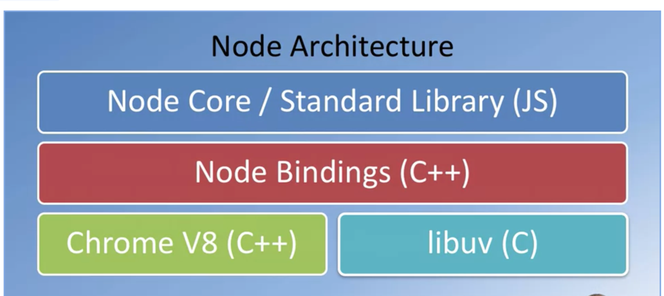

# Node.js

# Node Architecture

- Initially designed as a language for the browser
- Node Core / Standard Library (JS) , seen it move and bring value to the desktop
- Based on the Chrome V8 , engine from the browser to the Desktop
- Server application



- libuv (c) to communicate to o/s
- Node bindings in c++
- Node Core/ Std Library in JS , this what enables us to wrte javascript on the desktop


* Utilities in javascript, for web development Node.js use case for the web developmemt
  bower, grunt, gulp and yeoman etc
* Server-side Development
  -web server, business logic and db access

## NPM - node package manager
* after the node install (nodejs.org) , admin and install available to all
* Check if installed 
  * node -v   |  v14.17.3
  * npm  -v   |  v 6.14.13

* create .gitignore
  node_modules

* manages the node ecosystem
* npm init | creates a new node project with package.json
* author, .. entry point (index.js by default index.html)
* A Package.json
  - JS files
  - package.json 
  - only specific versions will installed
  - makes the builds reproducible

### Install a lite server , node package

* To serve up the changes with your node project
* npm install lite-server --save-dev
* ....minutes
  ```
    * node_modules folder
    * comprises the lite server plus other node modules, folders that they are
      dependent on  
    * lite server documentation  on github
      "devDependencies": {
    "lite-server": "^2.6.1"
    * node modules folder can be reproduced using npm install
    * adding to the package.json file. 
    *     "start": "npm run lite",
           .......
           "lite" : "lite-server"
    * npm start | will then execute the commands in the package json for start
      ```
  > nodeprojectsimple@1.0.0 start
  > npm run lite
  > nodeprojectsimple@1.0.0 lite
  > lite-server

Every time you save the new contents are served

## h2


